# 🍽️ Yummy Restaurant — Web Booking Meja

Aplikasi web untuk reservasi meja restoran berbasis **CodeIgniter 4**, dilengkapi dengan dashboard admin untuk mengelola seluruh data reservasi.

---

## 📋 Tentang Proyek

**Yummy Restaurant** adalah aplikasi web yang memungkinkan pelanggan melakukan pemesanan meja secara online, memantau status reservasi, dan membatalkan booking jika diperlukan. Admin dapat mengelola seluruh data reservasi melalui dashboard yang dilengkapi fitur konfirmasi, pembatalan, dan penghapusan data.

Proyek ini dikembangkan sebagai **tugas besar mata kuliah Pemrograman Web** menggunakan framework CodeIgniter 4 dengan konsep MVC.

---

## ✨ Fitur Utama

### 👤 Sisi Pengguna

- **Registrasi & Login** — Autentikasi dengan enkripsi password menggunakan `password_hash()`
- **Halaman Beranda** — Informasi restoran, menu, events, chef, galeri, dan kontak
- **Form Booking Meja** — Pilih tanggal, waktu, jumlah tamu, dan meja secara visual
- **Cek Ketersediaan Meja** — Sistem otomatis menolak booking jika meja sudah terisi di waktu yang sama
- **Halaman Sukses Booking** — Menampilkan detail reservasi setelah berhasil submit
- **Riwayat Booking** — Cek semua reservasi berdasarkan email
- **Batalkan Booking** — User hanya bisa membatalkan booking miliknya sendiri (divalidasi via session)

### 🔧 Sisi Admin

- **Dashboard** — Statistik real-time: total reservasi, menunggu, dikonfirmasi, dibatalkan
- **Tabel Reservasi Terbaru** — Menampilkan 5 booking terbaru di halaman utama dashboard
- **Kelola Semua Reservasi** — Tabel lengkap dengan search, pagination, dan filter status
- **Konfirmasi Cepat** — Tombol konfirmasi/batalkan langsung dari tabel tanpa masuk halaman edit
- **Edit Reservasi** — Ubah semua detail booking termasuk status
- **Hapus Reservasi** — Dengan konfirmasi modal sebelum data dihapus

### 🔒 Keamanan

- CSRF protection aktif di semua form
- Role-based access control (user vs admin)
- Validasi input di frontend dan backend
- Validasi tanggal booking tidak boleh di masa lalu
- Proteksi cancel booking berbasis session (bukan URL parameter)
- Password di-hash dengan `PASSWORD_DEFAULT` (bcrypt)

---

## 🛠️ Teknologi yang Digunakan

| Teknologi             | Keterangan                          |
| --------------------- | ----------------------------------- |
| **PHP 8.x**           | Bahasa pemrograman utama            |
| **CodeIgniter 4**     | Framework PHP (MVC)                 |
| **MySQL**             | Database                            |
| **Bootstrap 5**       | CSS framework untuk tampilan        |
| **Bootstrap Icons**   | Icon set                            |
| **AOS.js**            | Animasi scroll pada halaman utama   |
| **Simple-Datatables** | Tabel interaktif di dashboard admin |
| **Laragon**           | Local development environment       |

---

## 📁 Struktur Proyek

```
yummy/
├── app/
│   ├── Config/
│   │   ├── Filters.php       # Konfigurasi filter (CSRF, Auth, Admin)
│   │   └── Routes.php        # Definisi semua route
│   ├── Controllers/
│   │   ├── Auth.php          # Login, register, logout
│   │   ├── Booking.php       # Semua logika booking
│   │   ├── Dashboard.php     # Dashboard admin
│   │   └── Home.php          # Halaman beranda
│   ├── Filters/
│   │   ├── AuthFilter.php    # Proteksi halaman user (harus login)
│   │   └── AdminFilter.php   # Proteksi halaman admin (harus role admin)
│   ├── Models/
│   │   ├── BookingModel.php  # Model tabel bookings
│   │   └── UserModel.php     # Model tabel users
│   ├── Views/
│   │   ├── auth/             # Login & register
│   │   ├── booking/          # Form booking, sukses, my-bookings
│   │   ├── dashboard/        # Dashboard admin + layout
│   │   └── home.php          # Halaman utama restoran
│   └── Database/
│       └── Migrations/       # Struktur tabel users & bookings
└── public/                   # Entry point & assets
```

---

## 🗄️ Struktur Database

### Tabel `users`

| Kolom      | Tipe         | Keterangan          |
| ---------- | ------------ | ------------------- |
| id         | INT (PK)     | Auto increment      |
| username   | VARCHAR(50)  | Nama pengguna       |
| email      | VARCHAR(100) | Email unik          |
| password   | VARCHAR(255) | Bcrypt hash         |
| role       | ENUM         | `admin` atau `user` |
| created_at | DATETIME     |                     |
| updated_at | DATETIME     |                     |

### Tabel `bookings`

| Kolom       | Tipe         | Keterangan                          |
| ----------- | ------------ | ----------------------------------- |
| id          | INT (PK)     | Auto increment                      |
| nama        | VARCHAR(100) | Nama pemesan                        |
| telepon     | VARCHAR(15)  | Nomor telepon                       |
| email       | VARCHAR(100) | Email pemesan                       |
| tanggal     | DATE         | Tanggal reservasi                   |
| waktu       | VARCHAR(10)  | Waktu reservasi                     |
| jumlah_tamu | VARCHAR(10)  | Jumlah tamu                         |
| meja_id     | INT          | Nomor meja (1–6)                    |
| catatan     | TEXT         | Catatan khusus                      |
| status      | ENUM         | `pending`, `confirmed`, `cancelled` |
| created_at  | DATETIME     |                                     |
| updated_at  | DATETIME     |                                     |

---

## 🚀 Cara Instalasi

### Prasyarat

- PHP >= 8.0
- MySQL / MariaDB
- Composer
- Web server (Apache/Nginx) — disarankan menggunakan **Laragon**

### Langkah Instalasi

**1. Clone repository**

```bash
git clone https://github.com/Rayshan10/Yummy.git
cd yummy
```

**2. Install dependencies**

```bash
composer install
```

**3. Salin dan konfigurasi file environment**

```bash
cp env .env
```

Edit file `.env`:

```env
CI_ENVIRONMENT = development
app.baseURL = 'http://localhost/yummy/public'

database.default.hostname = localhost
database.default.database = book_a_table
database.default.username = root
database.default.password =
database.default.DBDriver = MySQLi
```

**4. Buat database**

Buat database baru bernama `book_a_table` di MySQL, lalu jalankan migration:

```bash
php spark migrate
```

**5. Buat akun admin**

Jalankan aplikasi, lalu daftarkan akun baru melalui halaman `/auth/register`. Setelah itu, ubah kolom `role` menjadi `admin` langsung di database:

```sql
UPDATE users SET role = 'admin' WHERE email = 'email_kamu@example.com';
```

**6. Akses aplikasi**

Buka browser dan akses:

```
http://localhost/yummy/public
```

---

## 📸 Screenshot

### Halaman Beranda

<p align="center">
    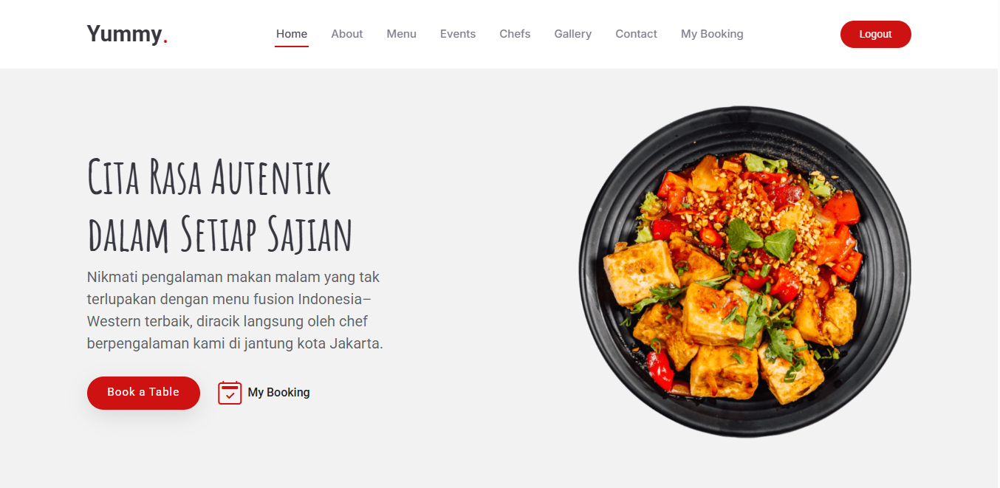
</p>

<p align="center">
    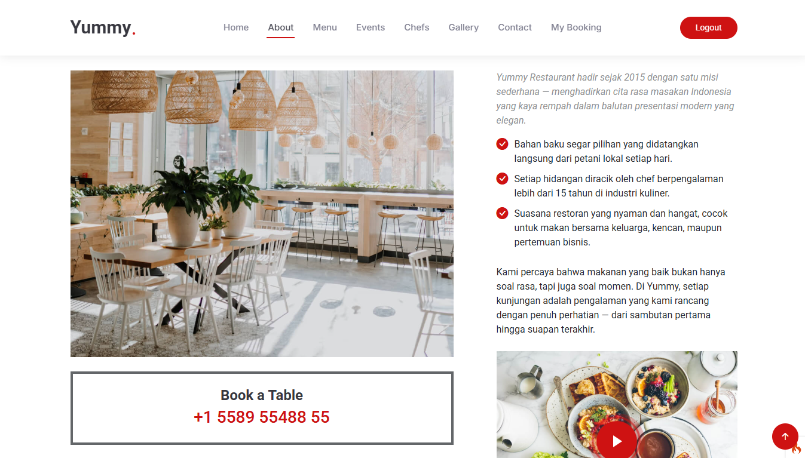
</p>

<p align="center">
    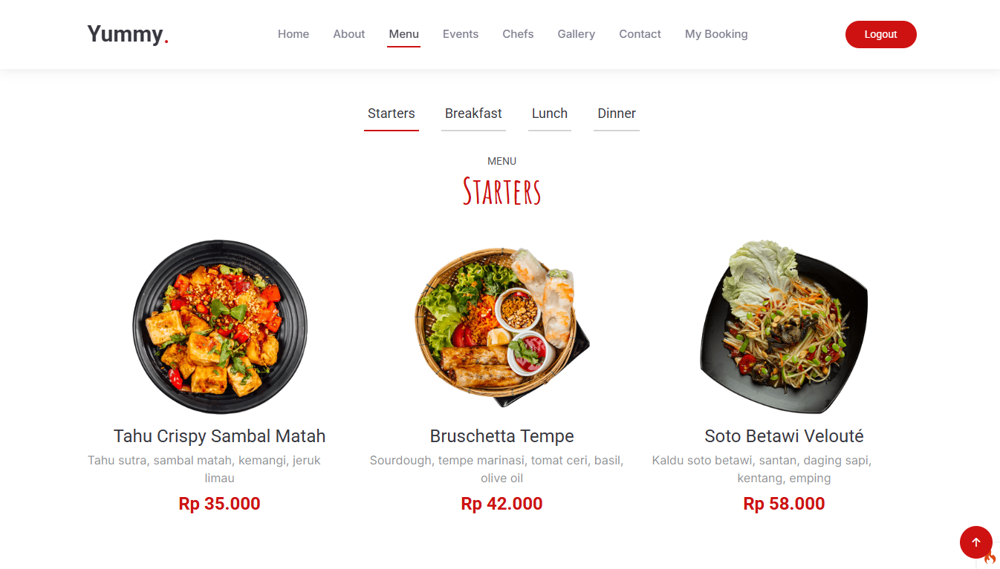
</p>

<p align="center">
    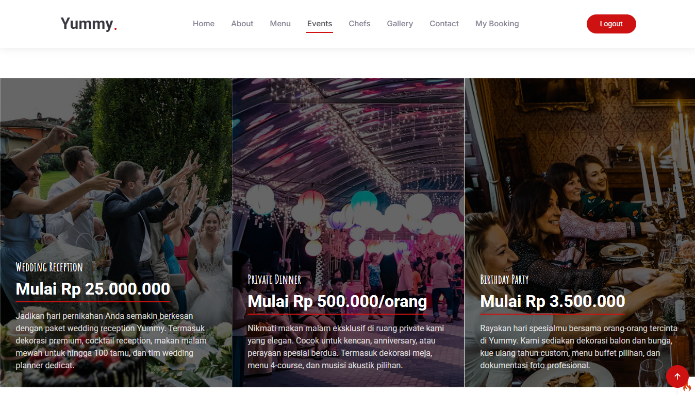
</p>

<p align="center">
    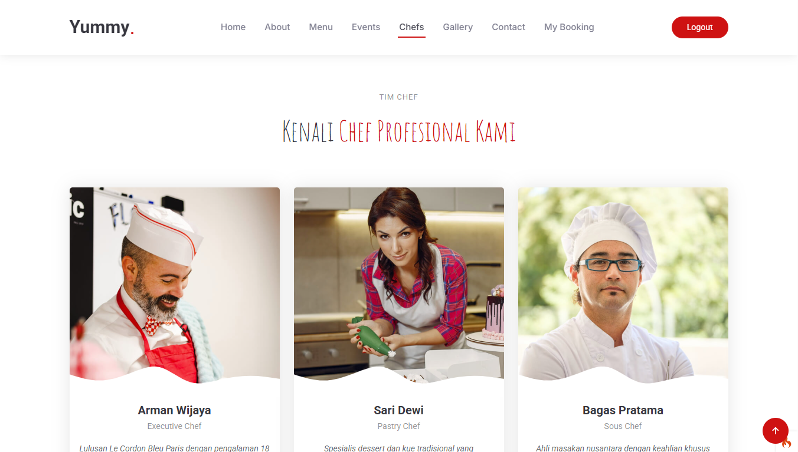
</p>

<p align="center">
    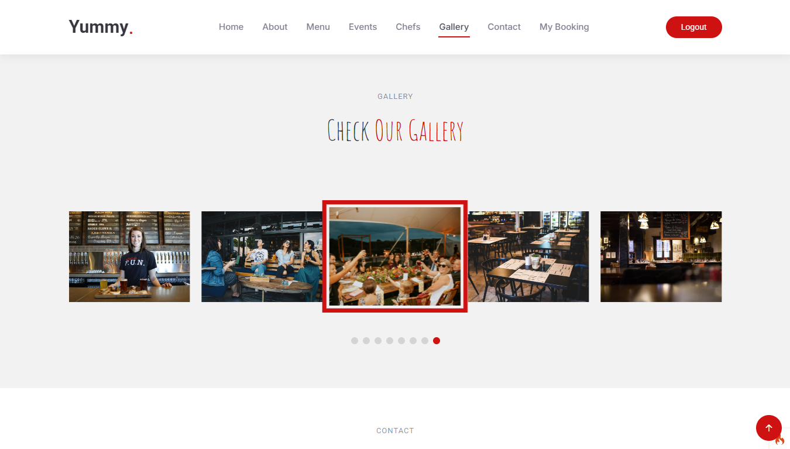
</p>

<p align="center">
    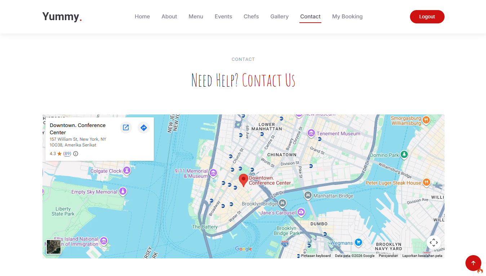
</p>

### Form Booking

<p align="center">
    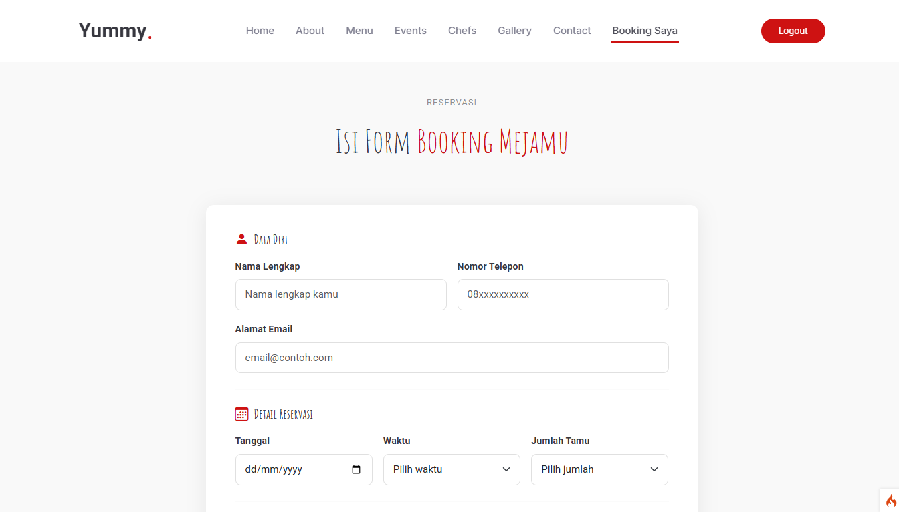
</p>

<p align="center">
    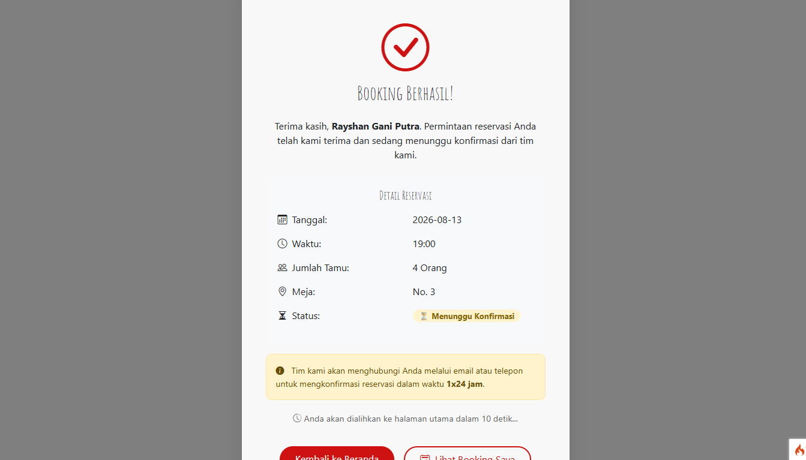
</p>

<p align="center">
    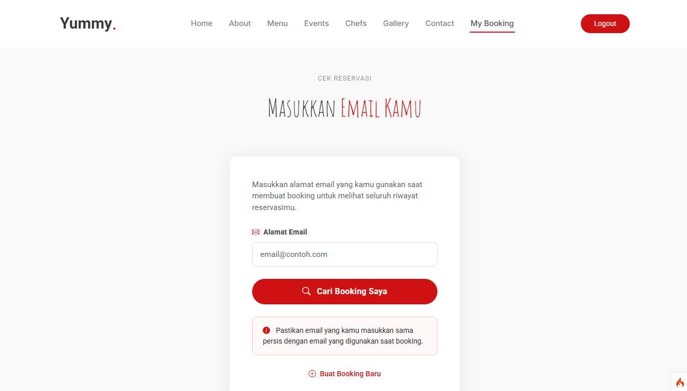
</p>

<p align="center">
    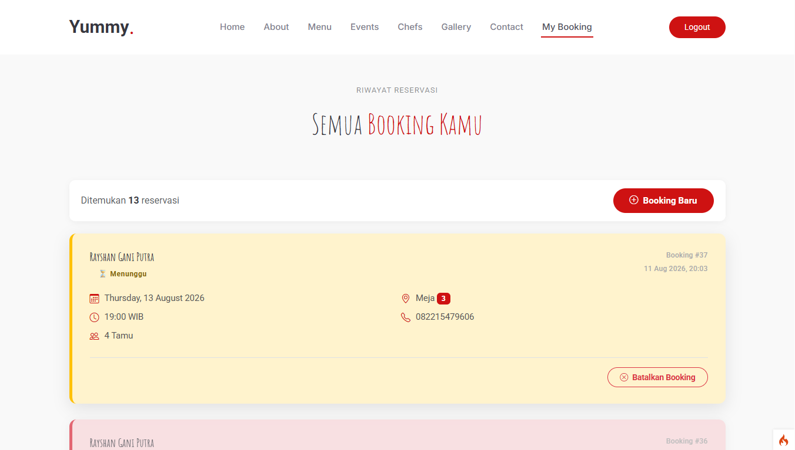
</p>

### Dashboard Admin

<p align="center">
    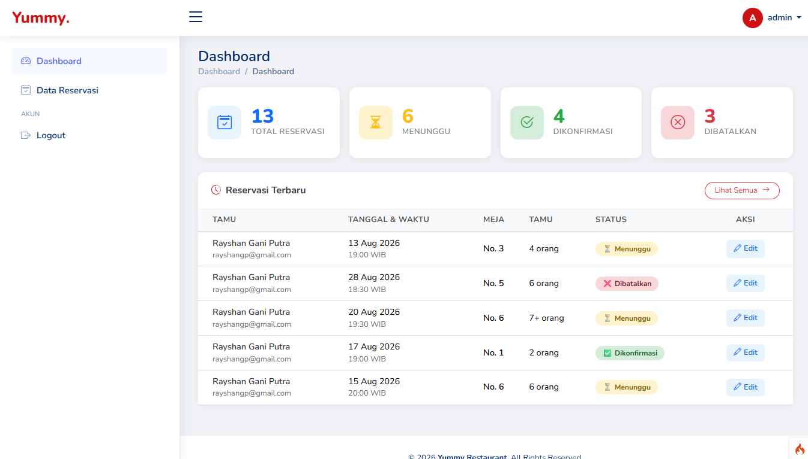
</p>

<p align="center">
    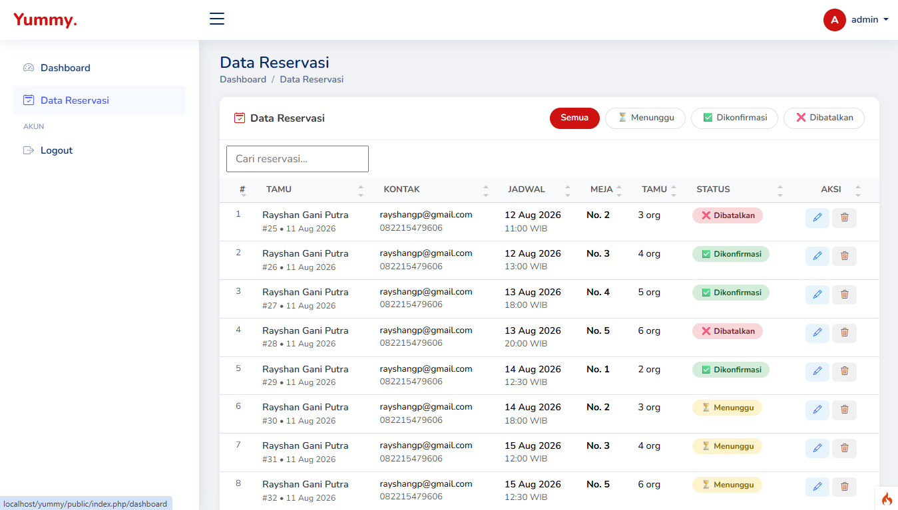
</p>

---

## 🔄 Alur Kerja Aplikasi

```
User Register/Login
        ↓
Halaman Beranda
        ↓
Form Booking → Validasi → Cek Ketersediaan Meja
        ↓
Status: PENDING (menunggu konfirmasi admin)
        ↓
Admin Login → Dashboard → Konfirmasi/Batalkan
        ↓
Status: CONFIRMED / CANCELLED
        ↓
User cek status via "Booking Saya"
```

---

## 👨‍💻 Developer

Dikembangkan oleh **Rayshan Gani Putra** sebagai proyek tugas kuliah.

- GitHub: https://github.com/Rayshan10
- Email: rayshangp@gmail.com

---

## 📄 Lisensi

Proyek ini dibuat untuk keperluan akademis. Template frontend menggunakan [Yummy - BootstrapMade](https://bootstrapmade.com/yummy-bootstrap-restaurant-website-template/) dan [NiceAdmin - BootstrapMade](https://bootstrapmade.com/nice-admin-bootstrap-admin-html-template/).
